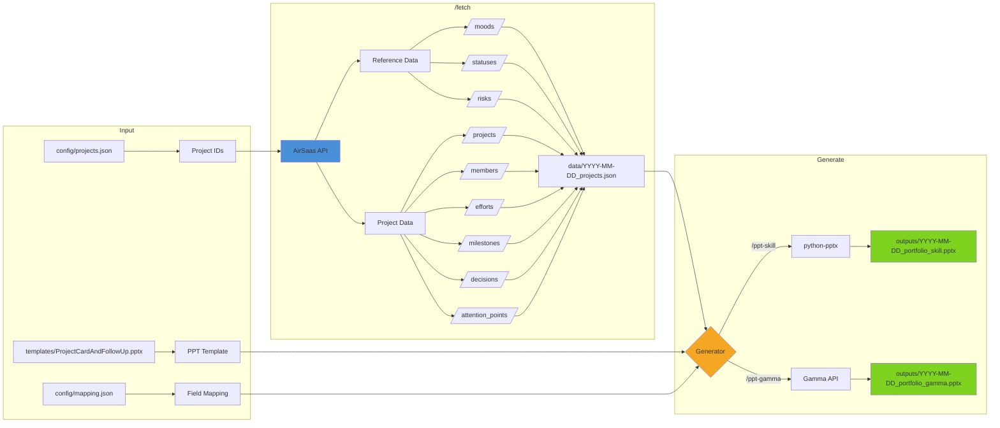
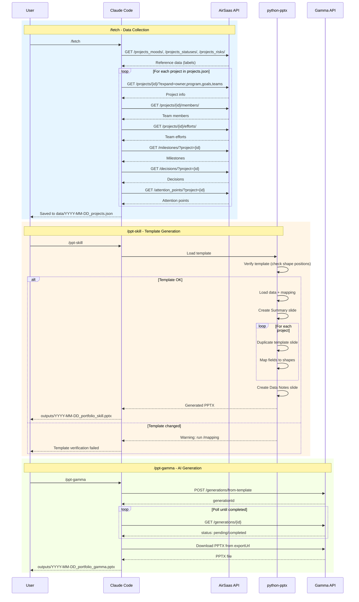

# Flash Report Custom AirSaas - POC

Automates the generation of PowerPoint portfolio reports from AirSaas project data. Fetches project information via the AirSaas API, maps data fields to PPT template placeholders, and generates presentations using python-pptx or Gamma API.

## How It Works





## Features

- Fetch project data from AirSaas API (projects, milestones, decisions, attention points)
- Resolve status/mood/risk codes to human-readable labels
- Generate PowerPoint presentations using a reference template
- Support for multiple output methods: python-pptx (programmatic) and Gamma API (AI-powered)
- Claude Code slash commands for streamlined workflow

## PPT Output Structure

Generated presentations follow this structure (per spec section 5.1):

| Slide | Content |
|-------|---------|
| 1 | **Summary** - List of all projects with mood/status |
| 2 to N | **Project slides** - One slide per project with details |
| Last | **Data Notes** - List of unfilled fields and API limitations |

## Requirements

- Python 3.8+
- python-pptx library
- AirSaas API key
- (Optional) Gamma API key for AI-powered generation

## Installation

1. Clone this repository
2. Install dependencies:
   ```bash
   pip install python-pptx
   ```
3. Copy `.env.example` to `.env` and add your API keys:
   ```bash
   cp .env.example .env
   ```
4. Place your PPT template as `templates/ProjectCardAndFollowUp.pptx`

## Configuration

### Environment Variables (.env)

| Variable | Required | Description |
|----------|----------|-------------|
| `AIRSAAS_API_KEY` | Yes | Your AirSaas API key |
| `AIRSAAS_BASE_URL` | No | API base URL (default: https://api.airsaas.io/v1) |
| `GAMMA_API_KEY` | No | Gamma API key (for /ppt-gamma command) |
| `GAMMA_BASE_URL` | No | Gamma API URL (default: https://public-api.gamma.app/v1.0) |
| `GAMMA_TEMPLATE_ID` | No | Gamma template ID (default: g_9d4wnyvr02om4zk) |

### Project Configuration (config/projects.json)

Add the projects you want to export:

```json
{
  "workspace": "your-workspace",
  "smartview": {
    "name": "Your SmartView Name",
    "id": "smartview-uuid"
  },
  "projects": [
    {
      "id": "project-uuid",
      "short_id": "PRJ-001",
      "name": "Project Name"
    }
  ]
}
```

Note: SmartView project lists are not available via API. Project IDs must be added manually from the AirSaas UI.

## Quick Start

After installation, follow these steps to generate your first report:

### Step 1: Get Project IDs from AirSaas

Since SmartView project lists are not available via API, you need to manually collect project IDs:

1. Go to your SmartView in AirSaas UI
2. Open each project you want to include
3. Copy the UUID from the URL: `https://app.airsaas.io/.../project/{UUID}`
4. Add them to `config/projects.json`:

```json
{
  "workspace": "aqme-corp-",
  "projects": [
    {
      "id": "a1b2c3d4-e5f6-7890-abcd-ef1234567890",
      "short_id": "PRJ-001",
      "name": "My First Project"
    },
    {
      "id": "b2c3d4e5-f6a7-8901-bcde-f12345678901",
      "short_id": "PRJ-002",
      "name": "My Second Project"
    }
  ]
}
```

### Step 2: Fetch Data

```bash
# With Claude Code
/fetch

# Or verify API connection first
curl -H "Authorization: Api-Key YOUR_KEY" https://api.airsaas.io/v1/projects/
```

### Step 3: Generate PPT

```bash
# With Claude Code (recommended)
/ppt-skill

# Or manually with Python
python3 scripts/generate_ppt.py
```

### Step 4: Find Your Output

Generated presentations are saved in `outputs/` with date prefix:
- `outputs/2026-01-12_portfolio_skill.pptx` (python-pptx)
- `outputs/2026-01-12_portfolio_gamma.pptx` (Gamma API, if configured)

Gamma API also generates debug/audit files:
- `outputs/gamma_prompt.md` - The prompt sent to Gamma API
- `outputs/gamma_generation.json` - Initial response with `generationId` (for resuming)
- `outputs/gamma_result.json` - Final response with Gamma URL and credits info

### Complete Workflow Example

```bash
# 1. Configure projects (edit config/projects.json)

# 2. Fetch fresh data from AirSaas
/fetch

# 3. Generate PPT using template
/ppt-skill

# Or do everything at once
/ppt-all
```

## Usage

### With Claude Code

Use the following slash commands:

| Command | Description |
|---------|-------------|
| `/fetch` | Fetch data from AirSaas API |
| `/ppt-skill` | Generate PPT using python-pptx |
| `/ppt-gamma` | Generate PPT using Gamma API |
| `/ppt-all` | Fetch data and generate both PPT versions |
| `/mapping` | Configure field mapping interactively |
| `/config` | View or edit configuration |

### Manual Execution

```bash
# Generate PPT from fetched data
python3 scripts/generate_ppt.py

# Verify template compatibility
python3 scripts/generate_ppt.py --verify

# Analyze template (show shape positions)
python3 scripts/generate_ppt.py --analyze
```

### Template Verification

The script automatically verifies the template before generating. If the template has changed, run:

```bash
# 1. Analyze new template structure
python3 scripts/generate_ppt.py --analyze

# 2. Run /mapping to sync field positions
/mapping
```

## Project Structure

```
flash-report-custom-airsaas-poc/
├── CLAUDE.md                    # Claude Code instructions
├── README.md                    # This file
├── .env                         # API credentials (gitignored)
├── .env.example                 # Credentials template
├── config/
│   ├── projects.json            # Projects to export
│   ├── mapping.json             # Field mapping configuration
│   └── template_shapes.json     # Template shape positions cache
├── templates/
│   └── ProjectCardAndFollowUp.pptx  # PPT template
├── data/
│   └── {date}_projects.json     # Fetched data cache
├── outputs/
│   ├── {date}_portfolio_skill.pptx  # Generated via python-pptx
│   ├── {date}_portfolio_gamma.pptx  # Generated via Gamma API
│   ├── gamma_prompt.md              # Prompt sent to Gamma (debug)
│   ├── gamma_generation.json        # Initial response (generationId)
│   └── gamma_result.json            # Final response (URLs, credits)
├── tracking/
│   ├── MISSING_FIELDS.md        # API fields not available
│   └── CLAUDE_ERRORS.md         # Error log
├── scripts/
│   ├── generate_ppt.py          # Python PPT generator (python-pptx)
│   └── airsaas_fetcher.gs       # Google Apps Script reference
└── .claude/commands/            # Slash command definitions
```

## API Reference

### AirSaas API

- **Authentication:** `Authorization: Api-Key {YOUR_KEY}`
- **Base URL:** `https://api.airsaas.io/v1`
- **Pagination:** max `page_size=20`
- **Rate Limits:** 15/sec, 500/min, 100k/day

### Available Endpoints

| Endpoint | Description |
|----------|-------------|
| `/projects/` | List all projects |
| `/projects/{id}/` | Single project details |
| `/projects/{id}/members/` | Project team members with roles |
| `/projects/{id}/efforts/` | Per-team effort breakdown |
| `/milestones/?project={id}` | Project milestones |
| `/decisions/?project={id}` | Project decisions |
| `/attention_points/?project={id}` | Project attention points |
| `/projects_moods/` | Mood code definitions |
| `/projects_statuses/` | Status code definitions |
| `/projects_risks/` | Risk code definitions |
| `/teams/` | All workspace teams |
| `/users/` | Workspace members |
| `/programs/` | Programs list |
| `/project_custom_attributes/` | Custom attribute definitions |

### Expandable Fields

Use `?expand=field1,field2` to include related objects:
- Projects: `owner`, `program`, `goals`, `teams`, `requesting_team`
- Milestones: `owner`, `team`, `project`
- Decisions: `owner`, `decision_maker`, `project`

## Template Mapping

The script maps AirSaas data to template shapes by name. Key mappings:

| Template Field | AirSaas Source |
|----------------|----------------|
| Project Name | `project.name` |
| Status | `resolved.status` |
| Mood | `resolved.mood` |
| Owner | `project.owner.name` |
| Start/End Date | `project.start_date`, `project.end_date` |
| Budget BAC | `project.budget_capex_initial` |
| Budget Actual | `project.budget_capex_used` |
| Budget EAC | `project.budget_capex_landing` |
| Effort | `project.effort`, `project.effort_used` |
| Team Efforts | `/projects/{id}/efforts/` |
| Progress | `project.progress` |
| Milestones | `milestones[]` |
| Decisions | `decisions[]` |
| Attention Points | `attention_points[]` |
| Members | `/projects/{id}/members/` |

### Known Missing Fields

These fields are not available in the public API:
- Deployment area
- End user counts (actual/target)
- Mood comment (free text)

### Gamma API (Optional)

- **Documentation:** https://developers.gamma.app/docs/getting-started
- **Authentication:** `X-API-KEY: {GAMMA_API_KEY}`
- **Access:** Pro, Ultra, Teams, or Business plan required
- **Credits:** ~40 credits per generation

#### Endpoints

| Endpoint | Supports imageOptions | Use Case |
|----------|----------------------|----------|
| `/v1.0/generations/from-template` | ❌ NO | Generate from template (primary) |
| `/v1.0/generations` | ✅ YES | Generate from text |
| `/v1.0/generations/{id}` | N/A | Poll generation status |

#### from-template Request (VERIFIED)

```json
{
  "gammaId": "template-id",
  "prompt": "Your content...",
  "exportAs": "pptx"
}
```

⚠️ **DO NOT USE** `imageOptions`, `textMode`, `cardSplit`, `numCards` with `/from-template` endpoint.

#### Gamma Generation

The `/ppt-gamma` command is executed by Claude Code, which:
1. Loads fetched data from `data/` folder
2. Builds a markdown prompt dynamically based on `mapping.json`
3. Calls Gamma API `/generations/from-template` endpoint
4. Polls for completion every 3 seconds
5. Downloads and saves the PPTX to `outputs/`

No separate script required - Claude Code handles all steps.

## License

Internal use only.
